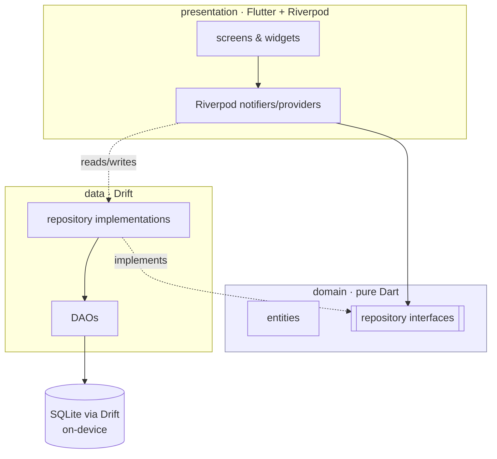
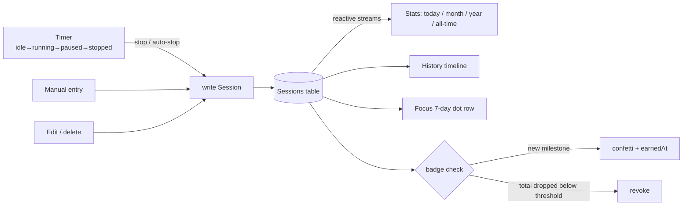
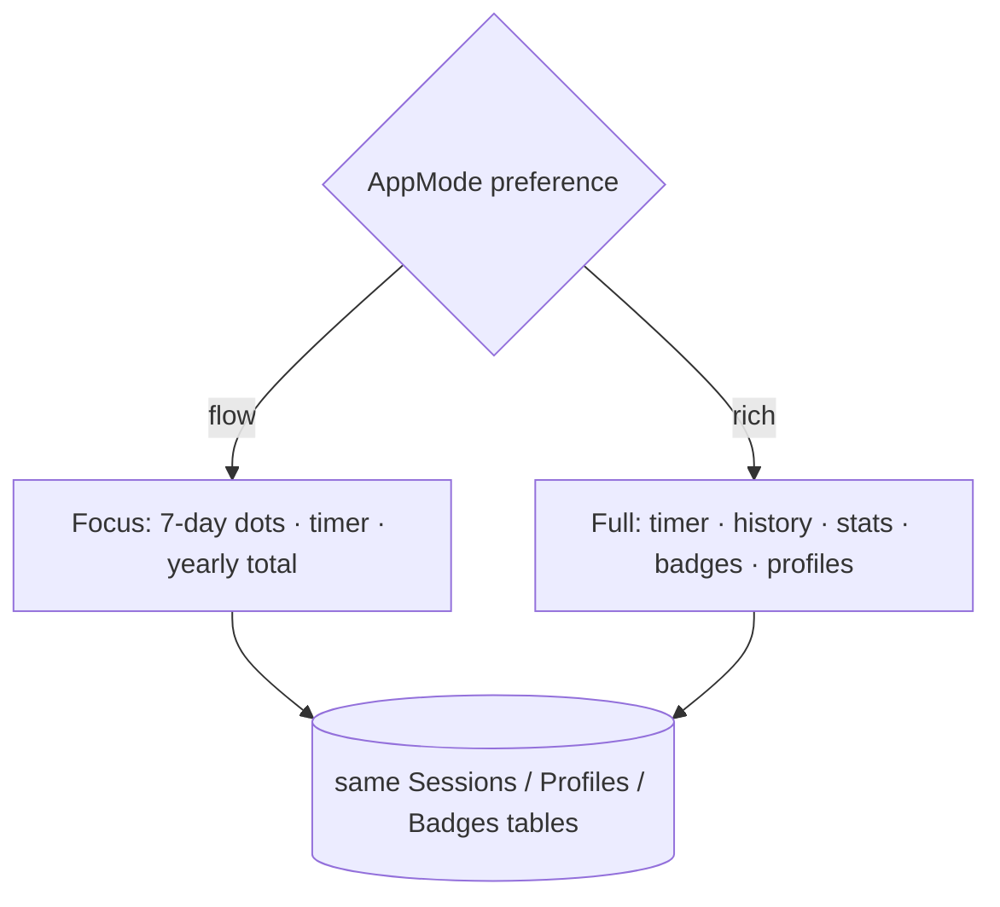

# Architecture Overview

> The one-page mental model of Sundial, then the diagrams that make it concrete.
> For *why* each load-bearing decision was made, see [`docs/adr/`](../adr/). For the
> domain ideas in prose, see [`concepts.md`](../concepts.md).

## What this is, in one paragraph

Sundial is a **Flutter app that logs time spent outdoors**, entirely on-device. It
follows **Clean Architecture, feature-first**: every feature is a self-contained
slice with three layers — `domain/` (plain entities + an abstract repository
interface), `data/` (a Drift DAO + the repository implementation), and
`presentation/` (screens/widgets + Riverpod controllers). State flows through
**Riverpod**; persistence is **Drift/SQLite**; navigation is **go_router**. There is
no network layer and no backend — the whole app runs offline.

## The layers (the single most important picture)

Dependencies point *inward*. Presentation depends on domain; data implements domain;
domain depends on nothing. The UI never touches Drift directly — it goes through a
repository interface, which is the seam that keeps the core testable and swappable.

Two facts to hold onto:

1. **The repository interface is the seam.** Presentation talks to
   `SessionsRepository`, not to `SessionsDao`. Tests swap in an in-memory database;
   a future sync layer would swap in a different implementation without the UI
   noticing. See [ADR-0001](../adr/0001-flutter-clean-architecture.md).
2. **There is no outward edge.** Nothing in this diagram reaches the network. The
   only I/O is the local SQLite file (and platform channels for the Android widget /
   notification). That is a design invariant, not an accident — see
   [ADR-0004](../adr/0004-local-first-ghost-tier.md).

## The core loop (timer → session → stats)

The everyday path: run the timer, persist a session, and every aggregate view
recomputes reactively off the same table.

- A **session** is `(startTime, endTime, durationSecs, dateDay, profileId?, notes?)`.
  `durationSecs` is stored, not derived, so editing a duration is a first-class,
  loss-free operation.
- **Auto-stop** is a pure predicate (`AutoStopService.shouldTrigger`) checked on app
  resume; it only fires if the user opted in. See
  [ADR-0005](../adr/0005-forgiveness-over-prevention.md).
- **Badges** are recomputed from the all-time total: earned when the total crosses a
  threshold, and (as currently shipped) revoked if it drops back below one. See
  [concepts.md § badges](../concepts.md#badges).

## Two surfaces, one data model

Focus mode and Full mode are the *same* sessions rendered differently. A single
`AppMode` preference (`flow` | `rich`) picks the surface; the app shell routes
accordingly. No data is hidden behind a mode — switching is instant and lossless.
See [ADR-0006](../adr/0006-focus-mode-as-surface.md).

## Consumption surfaces

| Surface | Where | Notes |
|---|---|---|
| Android app | `flutter build apk` | Home-screen widget + media-style timer notification via platform channels (`main.dart`, `MainActivity.kt`) |
| Web PWA | `flutter build web` | Drift runs on `sqlite3.wasm` + `drift_worker.js` (shipped in `web/`); layout centered at 760px |

## Module map (where to look)

| Concern | Where |
|---|---|
| **App entry / lifecycle / platform channels** | `lib/main.dart` |
| **Database schema & migrations** | `lib/core/storage/app_database.dart` |
| **Routing & app shell** | `lib/core/router/` (`app_router.dart`, `app_shell.dart`) |
| **Dependency injection** | `lib/core/providers/core_providers.dart` |
| **Auth tiers** (ghost today; token/named stubbed) | `lib/core/auth/` |
| **Error / failure types** | `lib/core/error/failures.dart` |
| **Timer** | `lib/features/timer/` |
| **Sessions** (record / edit / history / manual entry) | `lib/features/sessions/` |
| **Stats & charts** | `lib/features/stats/` |
| **Badges** | `lib/features/badges/` |
| **Focus mode** | `lib/features/flow_mode/` |
| **Profiles** | `lib/features/profiles/` |
| **Settings / preferences** | `lib/features/settings/` |
| **Export / import** | `lib/features/export/` |
| **Onboarding** | `lib/features/onboarding/` |
| **Theme / shared widgets / extensions** | `lib/shared/` |

## Invariants that must always hold

Breaking one is a design regression, not a feature. (See [VISION.md](../VISION.md)
and the [ADRs](../adr/).)

1. **No network in the core.** The shipped app runs fully offline; the only I/O is
   the local database and platform channels. No analytics, no telemetry, no BaaS.
2. **The repository interface is the only door to data.** Presentation never imports
   a DAO or Drift type directly.
3. **Sessions are editable, always.** `durationSecs` is stored; no edit lock-out.
4. **Focus and Full are the same data.** Mode is a render choice, never a data gate.
5. **Aggregates are reactive.** Stats, history, and the dot row are streams off the
   Sessions table — any add/edit/delete updates them without manual refresh.
